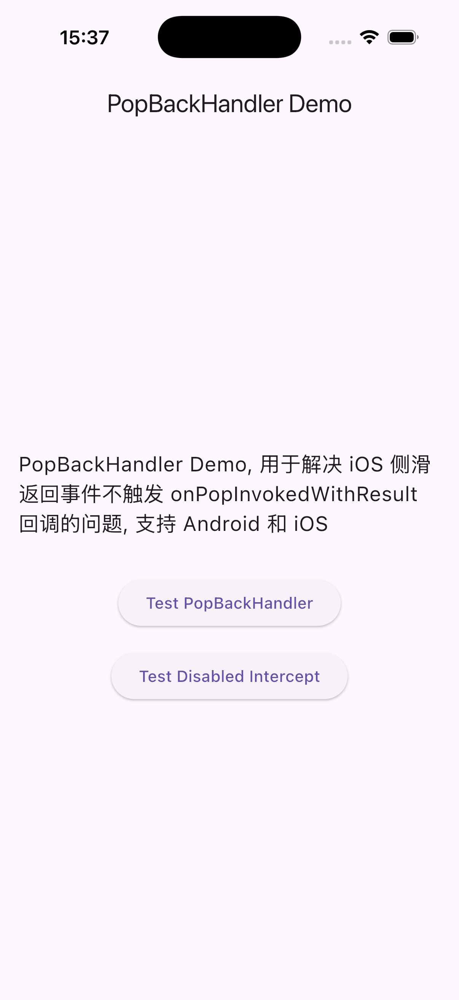
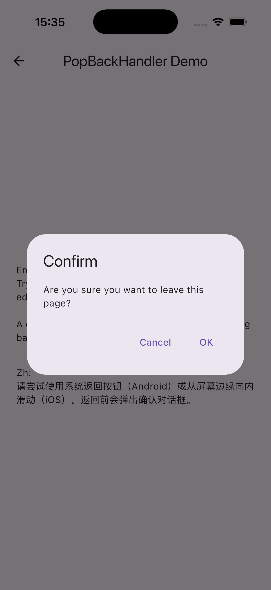

# pop_back_handler

[](https://pub.dev/packages/pop_back_handler)
[](https://opensource.org/licenses/MIT)

A Flutter widget that provides unified handling for back navigation events, integrating `PopScope` with iOS swipe-back gesture detection.

## Features

- ✅ **Unified API** - Single callback for all back navigation events
- ✅ **Android Support** - Intercepts system back button via `PopScope`
- ✅ **iOS Support** - Detects edge swipe gestures when interception is enabled
- ✅ **RTL Support** - Fully supports both LTR and RTL layout directions
- ✅ **Configurable** - Customizable edge width and swipe threshold
- ✅ **Toggle-able** - Easy to enable/disable interception at runtime

## Problem Solved

When using Flutter's `PopScope` with `canPop: false`, iOS edge swipe gestures don't trigger the `onPopInvokedWithResult` callback. This package solves this by adding a `GestureDetector` layer that detects iOS edge swipes and triggers the same callback.

## Installation

Add this to your package's `pubspec.yaml` file:

```yaml
dependencies:
  pop_back_handler: ^1.0.0
```

Then run:

```bash
flutter pub get
```

## Usage

### Basic Usage

Wrap your page content with `PopBackHandler` and provide an `onPopRequested` callback:

```dart
import 'package:pop_back_handler/pop_back_handler.dart';

class MyPage extends StatelessWidget {
  @override
  Widget build(BuildContext context) {
    return PopBackHandler(
      onPopRequested: () async {
        // Handle back navigation
        final shouldPop = await showConfirmDialog(context);
        if (shouldPop && context.mounted) {
          Navigator.pop(context);
        }
      },
      child: Scaffold(
        appBar: AppBar(title: Text('My Page')),
        body: YourContent(),
      ),
    );
  }
}
```

### With AppBar Back Button

Don't forget to also handle the AppBar's back button:

```dart
PopBackHandler(
  onPopRequested: _handleBack,
  child: Scaffold(
    appBar: AppBar(
      title: Text('My Page'),
      leading: IconButton(
        icon: Icon(Icons.arrow_back),
        onPressed: _handleBack,  // Use the same handler
      ),
    ),
    body: YourContent(),
  ),
);
```

### Disable Interception

You can disable interception to allow normal back navigation:

```dart
PopBackHandler(
  enableInterceptBack: false,  // System back gesture works normally
  onPopRequested: () {
    // This won't be called when interception is disabled
  },
  child: YourContent(),
);
```

### Custom Sensitivity

Adjust the edge detection sensitivity:

```dart
PopBackHandler(
  edgeWidth: 30.0,        // Edge trigger zone width (default: 20.0)
  swipeThreshold: 80.0,   // Swipe distance to trigger (default: 100.0)
  onPopRequested: _handleBack,
  child: YourContent(),
);
```

## API Reference

### PopBackHandler

| Property              | Type           | Default  | Description                                |
| --------------------- | -------------- | -------- | ------------------------------------------ |
| `child`               | `Widget`       | required | The widget below this widget in the tree   |
| `onPopRequested`      | `VoidCallback` | required | Callback when back navigation is requested |
| `enableInterceptBack` | `bool`         | `true`   | Whether to intercept back events           |
| `edgeWidth`           | `double`       | `20.0`   | iOS edge trigger zone width                |
| `swipeThreshold`      | `double`       | `100.0`  | iOS swipe distance threshold               |

## Example

See the [example](example/) directory for a complete sample app.

```bash
cd example
flutter run
```

## License

This project is licensed under the MIT License - see the [LICENSE](LICENSE) file for details.

## Contributing

Contributions are welcome! Please feel free to submit a Pull Request.




